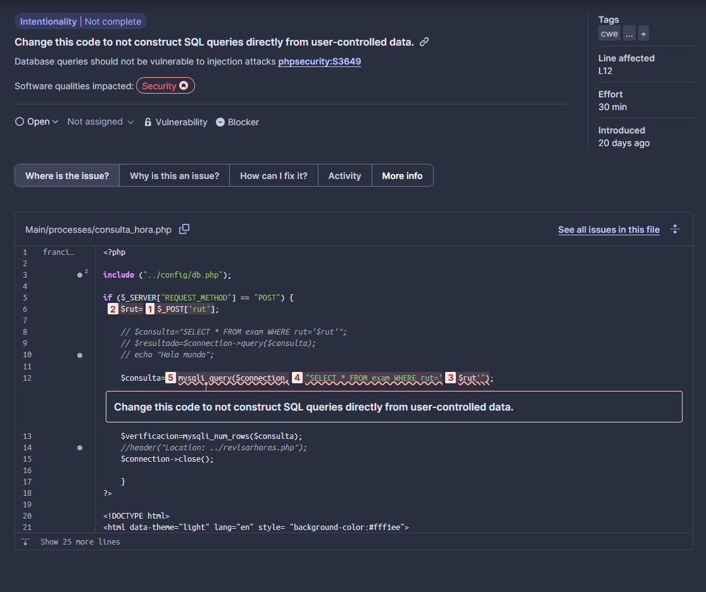
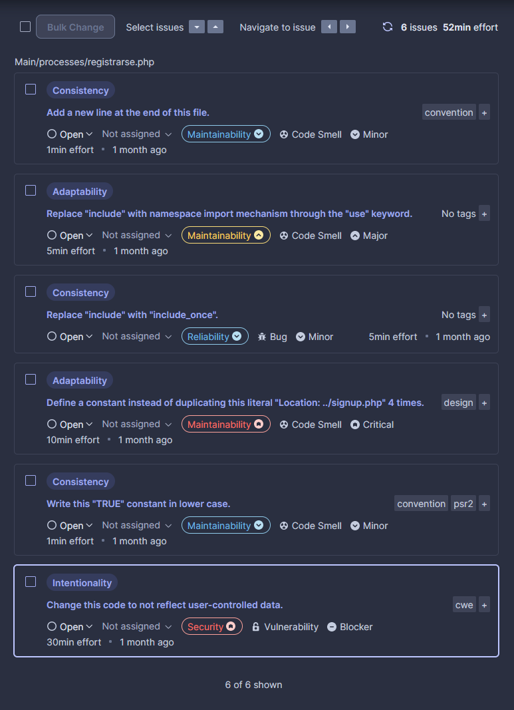
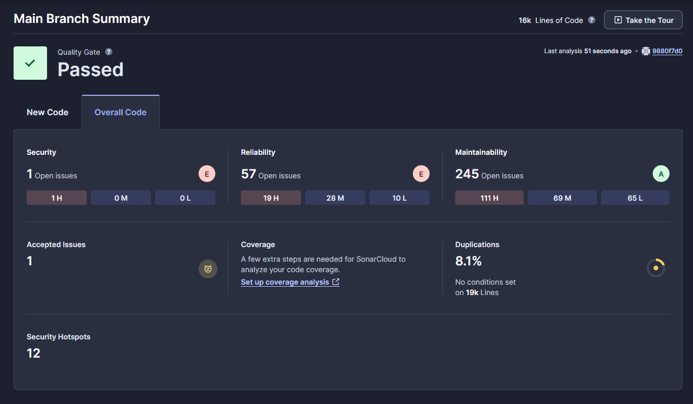

Issue 1, tipo _Responsability_

Severidad: Alta
El field de password no se encuentra seguro. Arreglarlo es relativamente fácil y solo requiere un par de líneas nuevas.

Issue 2, tipo Intentionality

Severidad: Alta
En su configuración actual, podría usarse SQL Injection hacia la base de datos, arreglar esto requiere una refactorización completa de este proceso.

Issues en registrarse.php:

Summary:
